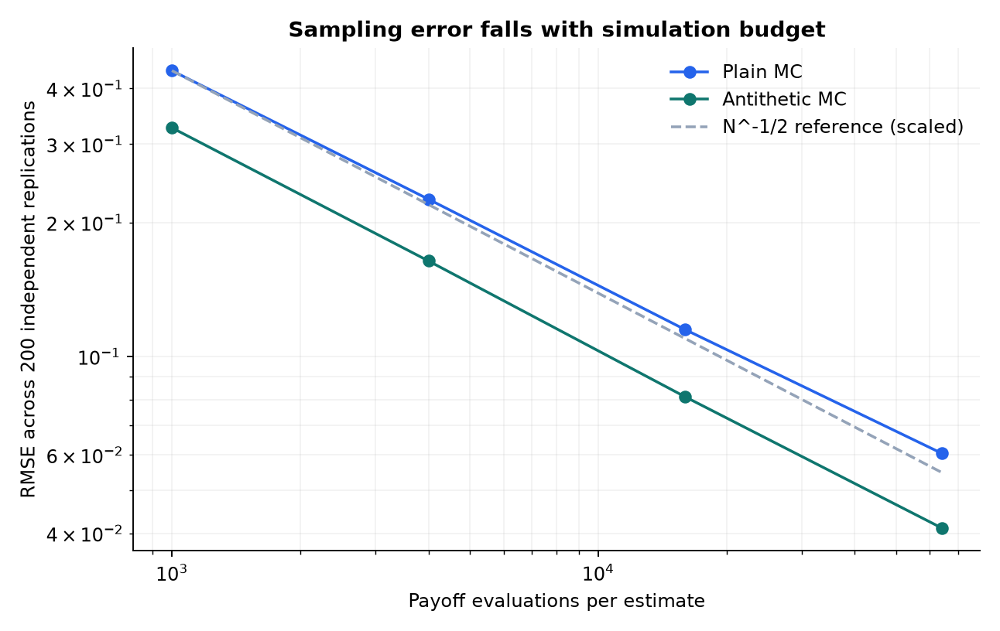
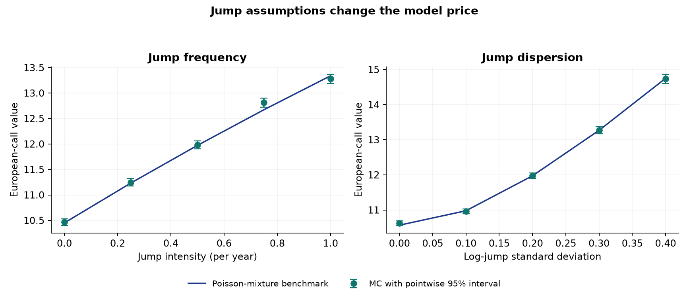

# Monte Carlo Option Pricing

**How do simulation budget, variance reduction, and jump assumptions affect European-call estimates?**

A numerical study developed from Andres Aguirre Torres's Penn State MATH 448 and MATH 451 honors projects. It compares plain and antithetic Monte Carlo with Black–Scholes pricing, then checks Merton jump-diffusion simulation against a Poisson-mixture benchmark.

## Main result

For a one-year, at-the-money call with spot and strike 100, annual interest rate 5%, and diffusion volatility 20%, antithetic sampling reduced empirical estimator variance by **1.8–2.2×** at equal payoff-evaluation budgets in the seeded experiment below.

Each row uses **200 independent replications per method**. The variance ratio is plain-MC variance divided by antithetic-MC variance; it is not a runtime speedup.

| Payoff evaluations | Plain MC RMSE | Antithetic RMSE | Variance ratio |
|---:|---:|---:|---:|
| 1,000 | 0.4386 | 0.3263 | 1.81× |
| 4,000 | 0.2254 | 0.1638 | 1.90× |
| 16,000 | 0.1148 | 0.0811 | 2.02× |
| 64,000 | 0.0605 | 0.0411 | 2.15× |



The exact Black–Scholes reference is **10.45058357**. Results and environment versions are saved in [results.json](results/results.json), with master seed `20260928`.

## Run the study

From the repository root, using Python 3.12:

```bash
python -m venv .venv
```

Activate the environment with `.venv\Scripts\Activate.ps1` in Windows PowerShell or `source .venv/bin/activate` on macOS/Linux. Then:

```bash
python -m pip install -r requirements.txt
python -m unittest -v
python experiments.py
```

The experiments use simulated inputs and require no market data, API keys, or network access after dependency installation. Running the script regenerates all three figures and the JSON results.

## What is implemented

- Black–Scholes analytic call pricing, including zero-maturity and zero-volatility cases.
- Exact GBM terminal sampling and plain Monte Carlo standard errors.
- Antithetic sampling with uncertainty computed from **independent pair means**.
- Exact Merton terminal sampling with compensated risk-neutral drift.
- A Poisson-mixture benchmark with an explicit omitted-tail bound.
- Repeated-simulation RMSE, variance comparisons, interval coverage, and two jump-parameter sweeps.

The pricing functions are in [pricing.py](pricing.py); the experiment design is in [experiments.py](experiments.py). See [METHODS.md](METHODS.md) for formulas and [PROVENANCE.md](PROVENANCE.md) for changes from the coursework.

## Jump-model sensitivity



The jump sweeps hold the log-jump mean at −0.05. The left panel fixes its standard deviation at 0.20; the right fixes annual jump intensity at 0.50. Each simulated point uses 200,000 draws. Error bars represent pointwise sampling uncertainty, so they need not all cover their benchmarks. They do not measure uncertainty about the model parameters.

The price at intensity 0.50 and log-jump standard deviation 0.20 is **11.97237723**, compared with **10.45058357** without jumps. This illustrates sensitivity to the selected model assumptions; no market calibration was performed.

## Validation and limitations

Seven focused tests check a known Black–Scholes value, numerical quadrature, limiting cases, pair-based uncertainty, Monte Carlo agreement with benchmarks, the discounted-stock martingale condition, and invalid inputs. They passed in the Python 3.12 environment recorded in the results file.

This study prices European calls on a non-dividend-paying asset under constant parameters. It does not implement calibration, hedging, American exercise, transaction costs, or an investment strategy. Variance ratios and empirical coverage vary across finite replication sets. Confidence intervals are asymptotic and pointwise. The reference implementation is intended for moderate parameter values, not extreme-tail production pricing.

## References

- Black, F. and Scholes, M. (1973). *The Pricing of Options and Corporate Liabilities*. Journal of Political Economy, 81(3), 637–654.
- [Merton, R. C. (1976). *Option pricing when underlying stock returns are discontinuous*.](https://doi.org/10.1016/0304-405X%2876%2990022-2) Journal of Financial Economics, 3(1–2), 125–144.

The September 2026 refactor, new benchmark, checks, experiments, and documentation were prepared with AI assistance. The established pricing models are credited above.
